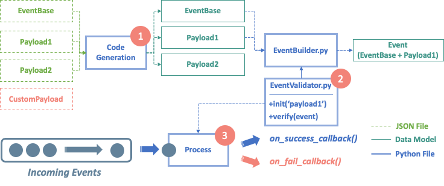

# Event Validation Framework

## Introduction



1. **Code Generation**
    
    Generate data models (`pydantic`) via the user-defined schemas (JSON format). Generated models are python files.
    
2. **EventValidator**
    
    `EventValidator` inherits from `EventBuilder`, it dynamically assembles `EventBae` and different payloads into a new data model.
    
3. **Process**
    
    Create `EventValidator` instance by the type of processing event. If the event is valid, call `on_success_callback()`, else `on_fail_callback()`.
    

    
🚀  All of you need to do is ***maintain your event schema***, this framework will handle the rest controls including code generating and importing new/modified data models.

## Project Structure

```bash
.
├── job.yaml
├── main.py
├── utils.py
├── models (auto-generate)
│   ├── EventBase.py
│   ├── PageViewPayload.py
│   └── RegisterPayload.py
│
├── schema
│   ├── ChannelEnum.json
│   ├── EventBase.json
│   ├── PageViewPayload.json
│   └── RegisterPayload.json
│
└── validator
    ├── EventBuilder.py
    └── EventValidator.py
```

There are two folders related to the valid task, schema, and model. 

- schema: Place user-defined JSONs, such as `Payload`, `Enum`.
- models: Place the `pydantic` models (.py) which are generated automatically by a command-line shell.

## User-defined Schema

This framework provides two types of schema (`JSON` format).

### Model

The model is used to define a structure of an event like the type of specific key. For more information, check all supported types in pydantic documents.

You can define your custom event schema by referring to the following JSON.

```json
{
    "title": "EventBase",
    "type": "object",
    "properties": {
        "event_type": {
            "title": "Event Type",
            "type": "string"
        },
        "user_id": {
            "title": "User Id",
            "type": "string",
            "format": "uuid4"
        },
        "event_timestamp": {
            "title": "Event Timestamp",
            "type": "string",
            "format": "date-time"
        },
        "event_payload": {
            "title": "Event Payload",
            "type": "null"
        }
    },
    "required": [
        "event_type",
        "user_id",
        "event_timestamp",
        "event_payload"
    ]
}
```

### Enum

By maintaining the JSON list, we can know the values in the specific `enum`.

```json
[
    "google", 
    "facebook"
]
```

### Control your program using yaml

In order to better achieve Configuration as code, you need to define some information about those types of events your want to verify in main program. (`job.yaml`)

## Job

```yaml
codegen:
  EventBase : './models/EventBase.py'
  PageView : './models/PageView.py'
  Register : './models/Register.py'

PageView:
  task: 'PageView'
  succ_dest: 'event_payload.destination_bq'
  enums : ~

Register:
  task: 'Register'
  succ_dest: 'event_payload.destination_bq'
  enums : 
    channel: './schema/ChannelEnum.json'
```

Terminology:

- **codegen**: `{filename}:{path}{filename}.py`, filenames needs to be equal.
    
    File paths for automatic code generation.
    
- **Event**:
    - **task**: string, task name.
    - **succ_dest**: `{layer1}.{layer2}`
        
        Output destination, use a period to determine the next layer in the nested dictionary.
        
        For example, `event_payload.destination_bq` means your destination value is locate in `event[event_payload][destination_bq]`.
        
    - **enums**: `{enum_key}:{enum_path}`
        
        Bind the key in payloads with the user-defined enum (JSON file).
        
        For example, `channel:'./schema/ChannelEnum.json'` means the values of enum’s values which key is `channel`, are defined in `./schema/ChannelEnum.json`.
        

# Usage

### 0. Prepare the Environment

Install `requirements`

```bash
pip install requirements.txt
```

-----------

### 1. Define your Event & Enum

Suppose we have a new event named `Luli` as the following:

- Three properties:
    1. `user_id` : uuid4
    2. `input`: enum
    3. `output`: output destination
- All properties is required

```json
{
    "title": "LuliEvent",
    "type": "object",
    "properties": {
        "user_id": {
            "type": "string",
            "format": "uuid4"
        },
        "input": {
            "$ref": "#/definitions/Enum"
        },
        "output": {
            "type": "string"
        }
    },
    "required": [
        "user_id",
        "input",
        "output"
    ],
    "definitions": {
        "Enum": {
            "title": "Enum",
            "enum": []
        }
    }
}
```
`./schema/LuliEvent.json`

-----------

And we define a JSON file for available enums.

```json
[
    "Taipei", 
    "Taoyuan"
]
```
`./schema/LuliEnum.json`

-----------

### 2. Compose your job in yaml

```yaml
codegen:
  LuliEvent : './models/LuliEvent.py'

LuliEvent:
  task: 'LuliEvent'
  succ_dest: 'event_payload.output'
  enums : 
    input: './schema/LuliEnum.json'
```
`./luli_job.yaml`

-----------

### 2. Generate the python code

```bash
python main.py codegen --jobpath ./luli_job.yaml --schema ./schema/LuliEvent.json
```

-----------

After executing the above shell, there is a new python file will appear under the model folder.

```python
# generated by datamodel-codegen:
#   filename:  LuliEvent.json
#   timestamp: 2022-05-26T16:36:33+00:00

from __future__ import annotations

from typing import Any

from pydantic import UUID4, BaseModel, Field

class Enum(BaseModel):
    __root__: Any = Field(..., title='Enum')

class LuliEvent(BaseModel):
    user_id: UUID4
    input: Enum
    output: str
```
`./models/LuliEvent.py`

-----------

### 3. Verify your incoming event

There are two ways to verify your event data.
Our incoming event is like:
```json
{
    "event_type":"LuliEvent",
    "event_timestamp":1653529936,
    "user_id":"79c4f57e-e606-4c01-bee5-509e37f27ca8",
    "event_payload":{
        "user_id":"02a06dc2-088e-4534-8076-9ce08c50f711",
        "input":"Taoyuan",
        "output":"db.output_table"
    }
}
```
`testluli.json`

1. Verify a file by executing the shell
    
    ```bash
    python main.py process --jobpath ./luli_job.yaml --eventpath testluli.json
    2022-05-26 16:56:20,012 - INFO - [Success] LuliEvent is valid with model EventValidator
    ```

2. Verify a string by calling the function `process_event`.
    
    ```python
    from main import process_event
    from utils import load_event
    JOB_PATH='./luli_job.yaml'
    event=load_event('testluli.json')
    process_event(JOB_PATH, event)
    ```
    
    The successful event will be written in  `./test/success/db.output_table.txt`
    
    The unsuccessful event will be written in  `./test/fail/db.event_error_log.txt`

--- 

Pytest report:

```bash
----------- coverage: platform linux, python 3.7.5-final-0 -----------
Name                          Stmts   Miss  Cover
-------------------------------------------------
main.py                          67     19    72%
models/EventBase.py               9      0   100%
models/PageViewPayload.py         5      0   100%
models/RegisterPayload.py         8      0   100%
test_pageview.py                 44      1    98%
test_register.py                 25      1    96%
utils.py                         35      6    83%
validator/BaseValidator.py       24      0   100%
validator/EventValidator.py      16      0   100%
-------------------------------------------------
TOTAL                           233     27    88%

======================= 8 passed in 0.43s ========================================
```
